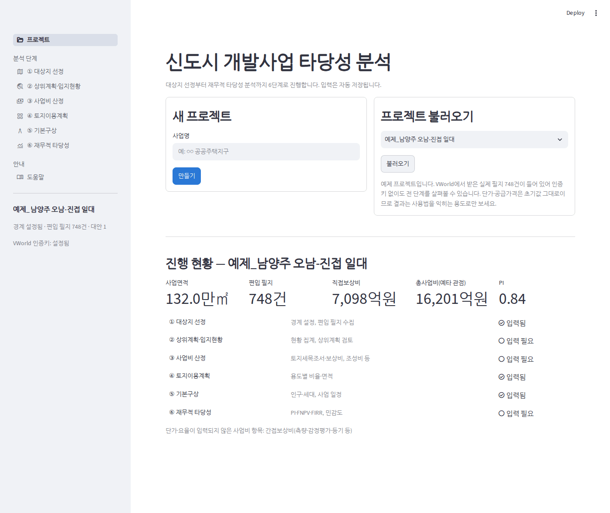
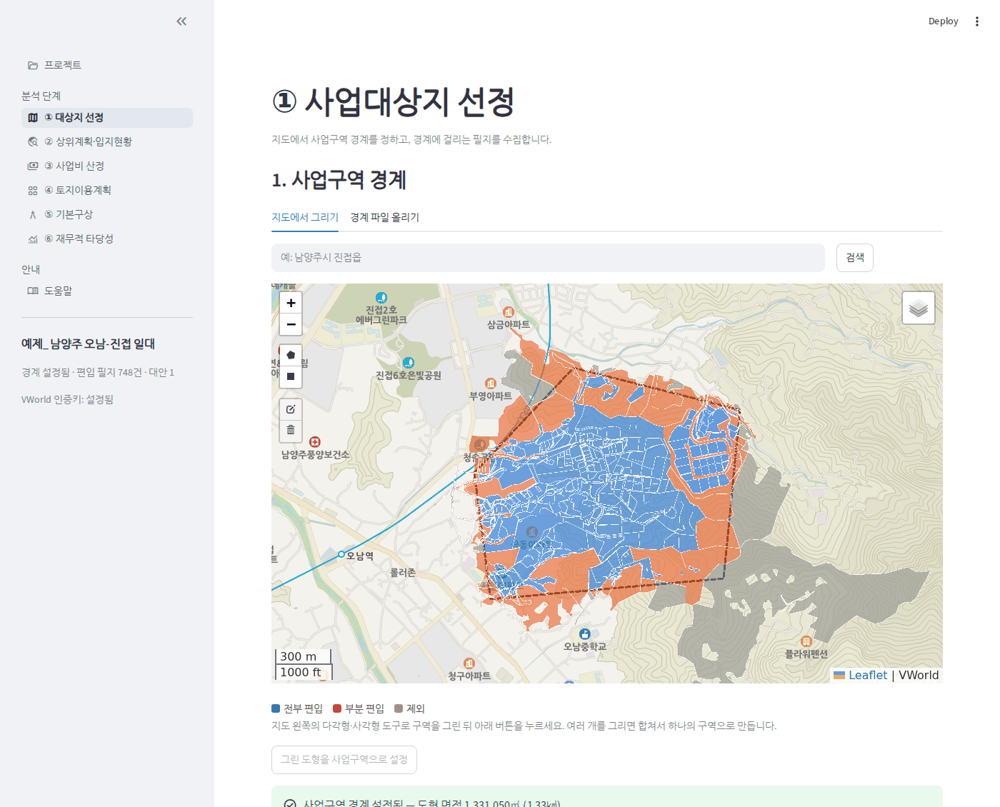
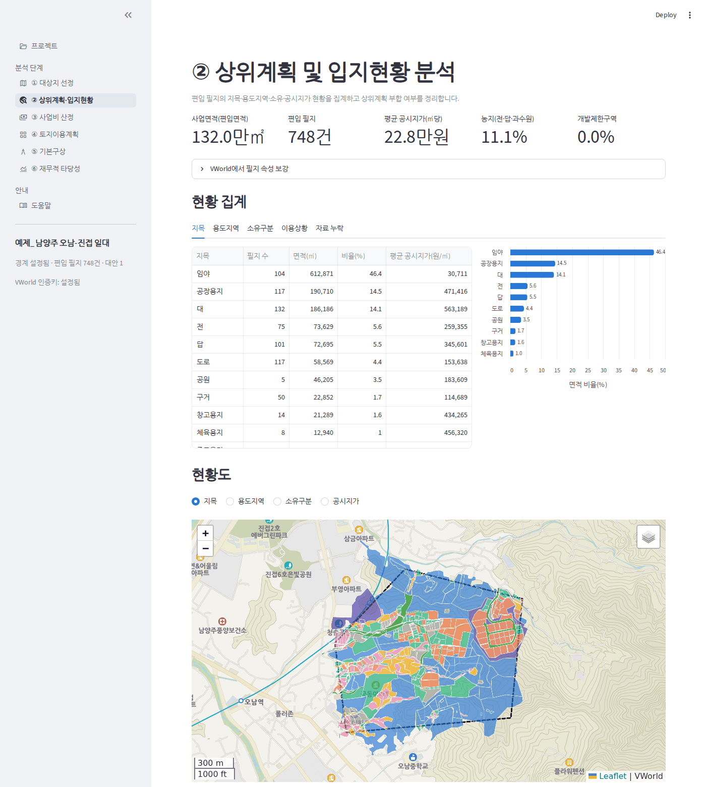
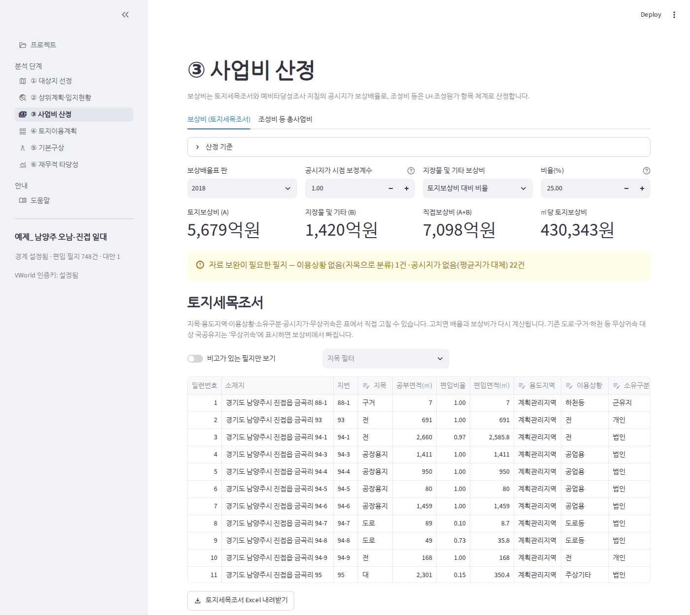
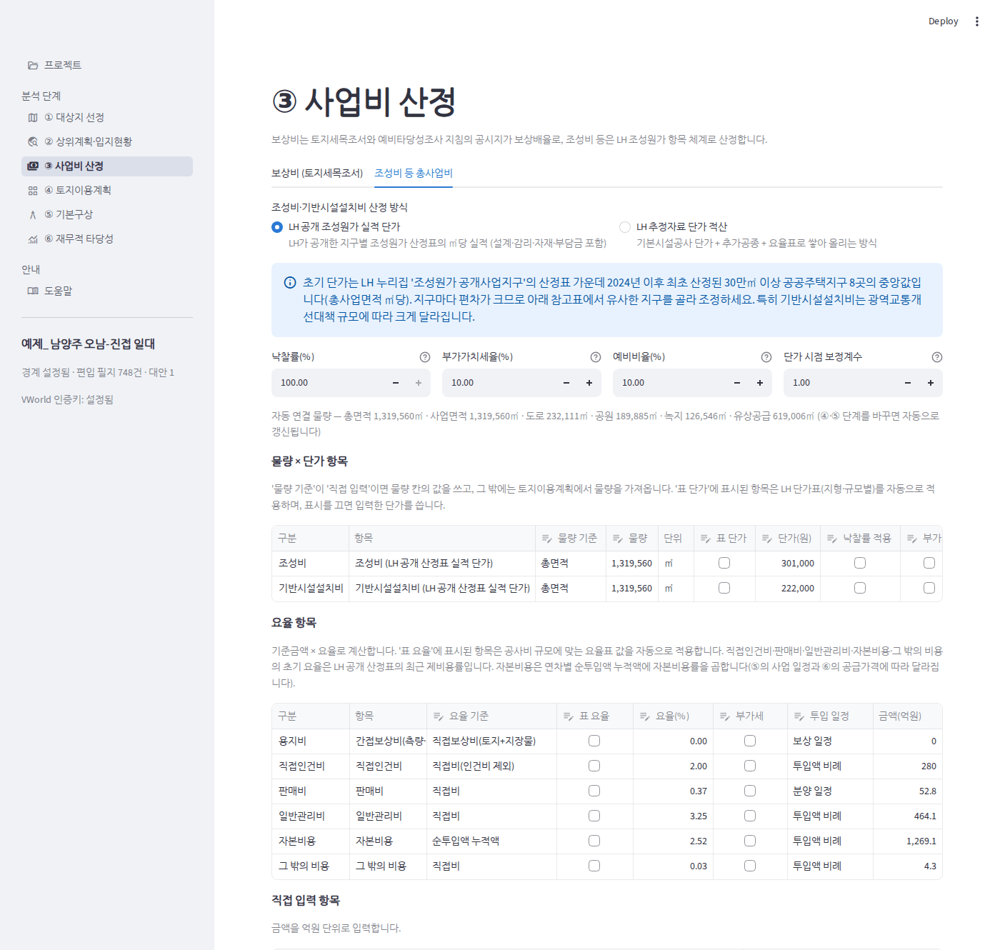
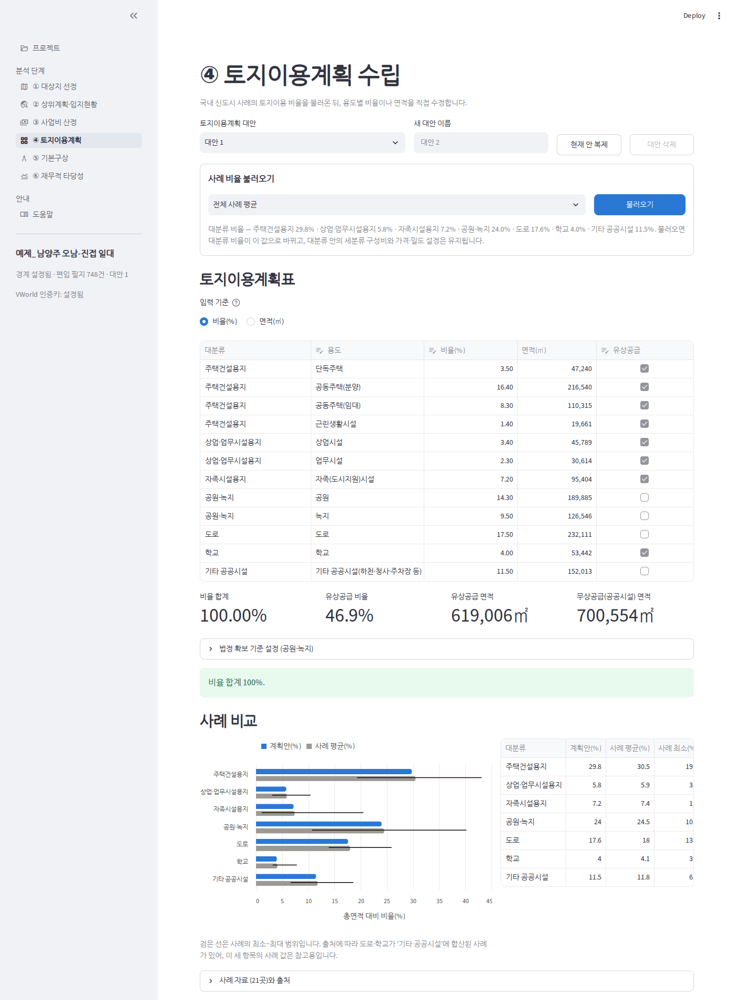
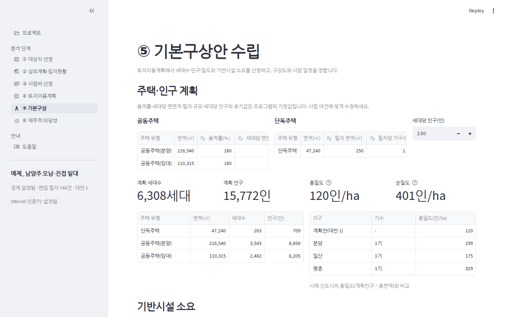
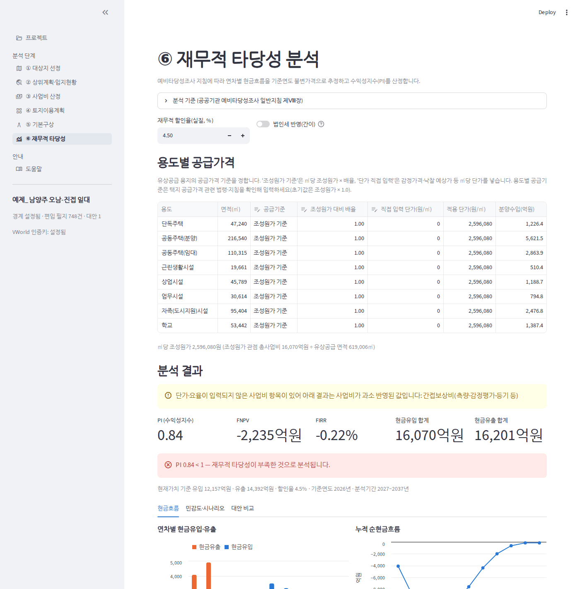

# 신도시 개발사업 타당성 분석 시스템 — 사용 설명서

이 문서는 화면을 어떤 순서로, 무엇을 눌러 쓰는지를 설명합니다.
숫자가 어떻게 계산되는지와 그 근거는 별도 문서 「산정 방법과 근거」(supplement.pdf)에 있습니다.

## 1. 한눈에 보기

이 프로그램은 신도시(택지·공공주택지구) 후보지를 정하면 사업비와 재무적 타당성까지 한 흐름으로 계산합니다.
왼쪽 메뉴의 여섯 단계를 위에서부터 차례로 진행합니다.

| 단계 | 화면 | 하는 일 | 결과물 |
|---|---|---|---|
| ① | 대상지 선정 | 사업구역 경계를 정하고 편입 필지를 모은다 | 경계, 편입 필지 목록 |
| ② | 상위계획·입지현황 | 필지 속성을 보강하고 현황을 집계한다 | 현황표, 현황도, 상위계획 검토표 |
| ③ | 사업비 산정 | 보상비와 조성비 등 총사업비를 산정한다 | 토지세목조서, 총사업비 |
| ④ | 토지이용계획 | 용도별 비율과 면적을 정한다 | 토지이용계획표 |
| ⑤ | 기본구상 | 인구·주택, 사업 일정을 정한다 | 계획지표, 일정 |
| ⑥ | 재무적 타당성 | 공급가격을 정하고 PI를 본다 | PI·FNPV·FIRR, Excel 보고서 |

알아둘 세 가지:

- **입력은 자동으로 저장됩니다.** 따로 저장 버튼이 없습니다.
- **앞 단계를 고치면 뒤 단계가 자동으로 다시 계산됩니다.** 예를 들어 ④에서 도로 비율을 바꾸면 ③의 사업비와 ⑥의 PI가 바로 바뀝니다. 순서를 오가며 써도 됩니다.
- **노란 경고 상자는 "이 값을 아직 믿으면 안 된다"는 뜻입니다.** 단가가 비어 있거나 필지 자료가 빠진 경우에 나옵니다.

## 2. 시작하기

### 2.1 프로젝트 만들기와 불러오기

첫 화면(프로젝트)에서 사업명을 넣고 **만들기**를 누릅니다. 전에 만든 프로젝트는 오른쪽 목록에서 골라 **불러오기**를 누릅니다.
프로젝트를 열면 아래에 진행 현황이 나옵니다. 각 단계 옆의 "입력됨 / 입력 필요"로 남은 일을 확인합니다.

목록의 **예제_남양주 오남-진접 일대**는 처음부터 들어 있는 예제 프로젝트입니다. VWorld에서 받은 실제 필지(약 1.3㎢, 748필지)와 속성이
들어 있어 인증키 없이도 전 단계를 살펴볼 수 있습니다. 구역은 사용법을 보여 주려고 임의로 잡은 것이고 단가·공급가격은 초기값 그대로이므로,
결과를 실제 사업성으로 읽어서는 안 됩니다.

### 2.2 VWorld 인증키

필지 자동 수집, 주소 검색, VWorld 배경지도를 쓰려면 VWorld 오픈API 인증키가 필요합니다.
왼쪽 메뉴 아래에 "VWorld 인증키: 설정됨"이라고 나오면 준비된 것입니다.

- 내 컴퓨터에서 실행할 때: 프로그램 폴더의 `.env` 파일에 `VWORLD_API_KEY`와 `VWORLD_DOMAIN`을 넣습니다. 도메인에는 포트 번호를 붙이지 않습니다(예: `http://localhost`).
- Streamlit Community Cloud에서 실행할 때: 앱 설정의 Secrets에 같은 두 값을 넣습니다.
- 키가 없어도 필지 파일을 올리거나 가상 필지로 전체 흐름을 시험할 수 있습니다.

## 3. ① 대상지 선정

### 3.1 사업구역 경계 정하기

방법은 두 가지입니다.

- **지도에서 그리기**: 주소·지명을 검색해 지도를 옮긴 뒤, 지도 왼쪽의 다각형(오각형 모양) 또는 사각형 도구로 구역을 그립니다. 그린 다음 **그린 도형을 사업구역으로 설정**을 누릅니다. 여러 개를 그리면 하나로 합쳐집니다.
- **경계 파일 올리기**: GeoJSON, KML, 또는 SHP를 묶은 ZIP 파일을 올리고 **이 파일을 사업구역으로 설정**을 누릅니다.

경계가 정해지면 초록 상자에 도형 면적이 나옵니다. 경계를 다시 정하면 그 전에 모은 필지는 지워집니다.

### 3.2 편입 필지 모으기

| 방법 | 언제 쓰나 | 누를 것 |
|---|---|---|
| VWorld에서 수집 | 인증키가 있을 때 (권장) | **필지 수집 시작** |
| 필지 파일 올리기 | 지적 파일을 따로 갖고 있을 때 | 파일 선택 후 **필지 불러오기** |
| 가상 필지 생성(시험용) | 화면과 계산 흐름만 시험할 때 | **가상 필지 생성** |

가상 필지는 지목·공시지가가 모두 임의 값입니다. 실제 분석에는 쓸 수 없고, 쓰는 동안 모든 화면에 경고가 나옵니다.

**최소 편입비율** 슬라이더는 경계에 살짝만 걸친 필지를 걸러내는 기준입니다. 기본값 0.05는 필지 면적의 5% 미만만 걸친 필지를 "제외"로 분류한다는 뜻입니다.

### 3.3 편입 필지 확인과 조정

지도에서 파란색은 전부 편입, 주황색은 부분 편입, 회색은 제외 필지입니다.
아래 표의 **편입** 칸을 눌러 필지별로 편입 여부를 바꿀 수 있습니다. **부분 편입·제외 필지만 보기**를 켜면 경계에 걸친 필지만 추려 볼 수 있습니다.

지도 오른쪽 위의 겹침 단추로 위성영상과 연속지적도를 켜고 끌 수 있습니다(인증키가 있을 때).

## 4. ② 상위계획·입지현황

### 4.1 필지 속성 보강 (VWorld 수집을 쓴 경우 꼭 하기)

연속지적도에는 지번과 공시지가만 있습니다. 보상배율을 정확히 적용하려면 용도지역·이용상황·소유구분이 필요하므로
**VWorld에서 필지 속성 보강**을 펼쳐 아래 두 단추를 차례로 누릅니다.

1. **용도지역 결합** — 용도지역·개발제한구역 도형과 겹쳐 필지의 용도지역을 채웁니다. 몇 초면 끝납니다.
2. **상세 조회 시작** — 토지특성(지목·면적·용도지역·이용상황·공시지가)과 소유구분을 받습니다. 필지 1만 건에 30초쯤 걸립니다.

### 4.2 현황 보기

- **현황 집계**: 지목·용도지역·소유구분·이용상황별 필지 수, 면적, 비율, 평균 공시지가. **자료 누락** 탭에서 속성이 빠진 필지 수를 확인합니다.
- **현황도**: 지목·용도지역·소유구분·공시지가 가운데 하나를 골라 필지를 색으로 구분해 봅니다. 필지에 마우스를 올리면 속성이 나옵니다.

### 4.3 상위계획 검토표

상위계획(국토종합계획, 수도권정비계획, 도시·군기본계획 등)은 자동으로 조회되지 않습니다.
표에 계획별 주요 내용과 부합 여부를 직접 적으면 Excel 보고서에 들어갑니다. 표 맨 아래 빈 줄에 계획을 추가할 수 있습니다.

## 5. ③ 사업비 산정

화면 위쪽에 탭이 두 개 있습니다.

### 5.1 보상비 (토지세목조서) 탭

위쪽 설정:

| 설정 | 뜻 |
|---|---|
| 보상배율표 판 | 적용할 공시지가 보상배율표 |
| 공시지가 시점 보정계수 | 공시지가 기준연도와 분석 기준연도가 다를 때 곱하는 값. 1.00이면 보정 없음 |
| 지장물 및 기타 보상비 | "토지보상비 대비 비율"(기본 25%) 또는 "금액 직접 입력" |

**토지세목조서** 표는 필지 한 건이 한 줄입니다. 지목·용도지역·이용상황·소유구분·개별공시지가·무상귀속 칸은 직접 고칠 수 있고, 고치면 배율과 보상비가 다시 계산됩니다.

- 기존 도로·구거·하천처럼 무상으로 귀속될 국공유지는 **무상귀속**에 표시하면 보상비에서 빠집니다.
- **비고가 있는 필지만 보기**를 켜면 자료가 빠져 대체값을 쓴 필지만 추려 볼 수 있습니다.
- **토지세목조서 Excel 내려받기**로 조서를 파일로 받습니다.

### 5.2 조성비 등 총사업비 탭

먼저 **조성비·기반시설설치비 산정 방식**을 고릅니다.

| 방식 | 언제 쓰나 |
|---|---|
| LH 공개 조성원가 실적 단가 | 기본. 계획 초기 단계에서 총면적에 ㎡당 실적 단가를 곱해 개략 산정 |
| LH 추정자료 단가 적산 | 공종과 물량을 어느 정도 아는 단계에서 항목별로 쌓아 올려 산정 |

그 아래 공통 설정:

| 설정 | 뜻 |
|---|---|
| 낙찰률(%) | "낙찰률 적용"에 표시한 공사비 항목에 곱한다 |
| 부가가치세율(%) | "부가세"에 표시한 항목에 더한다 |
| 예비비율(%) | 예타 재무 분석 관점의 사업비에만 더한다(기본 10%) |
| 단가 시점 보정계수 | 단가 기준시점과 분석 기준연도의 물가 차이. 물량 × 단가 항목에 곱한다 |
| 지형, 보존면적 | 적산 방식에서만 나온다. 기본시설공사 단가를 고르는 기준 |

항목은 세 표로 나뉘어 있고, 흰 칸은 직접 고칠 수 있습니다.

- **물량 × 단가 항목**: "물량 기준"이 "직접 입력"이면 물량 칸의 값을 쓰고, 그 밖에는 토지이용계획에서 면적을 가져옵니다. "표 단가"에 표시하면 LH 단가표를 자동으로 적용합니다.
- **요율 항목**: 기준금액에 요율을 곱합니다. "표 요율"에 표시하면 공사비 규모에 맞는 요율표 값을 자동으로 적용합니다.
- **직접 입력 항목**: 부담금, 이주대책비처럼 금액을 억원으로 직접 넣는 항목입니다.

근거 자료는 아래 접힌 상자에서 봅니다.

- **LH 공개 조성원가 산정표**: 지구별 ㎡당 조성비·기반시설설치비와 제비용률. "실적 단가의 근거로 쓸 지구"에서 유사한 지구만 남기고 **이 중앙값을 실적 단가로 적용**을 누르면 단가가 바뀝니다.
- **LH 추정자료 단가표 · 부대비 요율표**: 적산 방식의 단가와 요율표.
- **농지보전부담금 계산 도우미**: 편입 농지의 공시지가로 부담금을 계산해 항목에 반영합니다.

맨 아래 **총사업비**에서 두 관점의 금액과 ㎡당 조성원가를 확인합니다.

## 6. ④ 토지이용계획

1. **사례 비율 불러오기**에서 기준 사례(전체 평균, 기수별 평균, 개별 신도시)를 고르고 **불러오기**를 누릅니다.
2. **토지이용계획표**에서 용도별 **비율(%)**을 직접 고칩니다. "입력 기준"을 "면적(㎡)"으로 바꾸면 면적으로 입력할 수 있습니다. **유상공급** 칸으로 유상·무상을 바꿉니다.
3. 합계가 100%가 아니면 단추가 나타납니다.
   - **전체를 비례 조정해 100% 맞추기**: 모든 용도를 같은 비율로 늘리거나 줄입니다.
   - **차이를 이 용도에 반영**: 고른 용도 하나에 차이를 몰아 넣습니다.
4. 아래 **사례 비교**에서 계획안이 사례 평균·범위와 얼마나 다른지 봅니다.

그 밖의 기능:

- **대안**: "현재 안 복제"로 대안을 여러 개 만들어 두면 ⑥의 "대안 비교" 탭에서 결과를 나란히 볼 수 있습니다.
- **법정 확보 기준 설정**: 공원·녹지의 최소 비율과 1인당 최소 면적을 넣으면 충족 여부를 검사합니다. 사업 유형·규모별 기준은 같은 상자 안의 법령 정리를 참고합니다.

## 7. ⑤ 기본구상

- **주택·인구 계획**: 공동주택의 용적률과 세대당 연면적, 단독주택의 필지 면적과 필지당 가구수, 세대당 인구를 고치면 세대수·인구·밀도가 바뀝니다. 오른쪽 표에서 사례 신도시의 밀도와 비교합니다.
- **기반시설 소요**: 초등학교 수, 급수량, 오수량의 계산 기준을 고칩니다.
- **구상도**: 지도에 블록을 그리고 **그린 블록 추가**를 누른 뒤 표에서 블록별 용도를 고릅니다. 블록 면적 합계와 토지이용계획표의 차이가 나옵니다. 재무 계산에는 쓰이지 않는 참고 기능입니다.
- **사업 일정**: 착수 연도, 사업 기간, 분석 기준연도를 정하고, 연차별 보상·공사 투입 비율과 용도별 용지 공급 비율을 넣습니다. 각 열의 합계는 100%여야 합니다.
- **대금 회수 조건**: 용지 대금을 계약 연도, 1년 뒤, 2년 뒤에 각각 몇 %씩 받는지 넣습니다.

사업 일정은 ⑥의 현금흐름과 ③의 자본비용에 직접 영향을 줍니다. 공급을 늦출수록 PI가 낮아집니다.

## 8. ⑥ 재무적 타당성

### 8.1 공급가격 정하기

**용도별 공급가격** 표에서 유상공급 용지마다 공급기준을 고릅니다.

| 공급기준 | 입력할 것 | 쓰는 경우 |
|---|---|---|
| 조성원가 기준 | 조성원가 대비 배율 (예: 1.0, 0.8) | 조성원가에 연동해 공급하는 용지 |
| 단가 직접 입력 | ㎡당 단가(원) | 감정가격, 경쟁입찰 예상가로 공급하는 용지 |

초기값은 모든 용지가 "조성원가 × 1.0"입니다. 실제 분석에서는 용도별 공급기준을 반드시 넣어야 합니다.

### 8.2 결과 읽기

| 지표 | 뜻 | 판정 |
|---|---|---|
| PI (수익성지수) | 현금유입의 현재가치 ÷ 현금유출의 현재가치 | 1 이상이면 재무적 타당성 있음 |
| FNPV | 현금유입의 현재가치 − 현금유출의 현재가치 | 0 이상 |
| FIRR | FNPV를 0으로 만드는 할인율 | 할인율(기본 4.5%) 이상 |

세 지표는 같은 결론을 가리킵니다. 결과 아래에 초록(타당성 있음) 또는 빨강(부족) 상자로 판정이 나옵니다.

아래 탭:

- **현금흐름**: 연차별 유입·유출 그래프, 누적 순현금흐름, 현금흐름표.
- **민감도·시나리오**: 보상비·조성비·공급가격을 ±30%까지 바꿨을 때의 PI, 분양 지연과 할인율 변화의 영향, PI가 1이 되는 분기점.
- **대안 비교**: ④에서 만든 토지이용계획 대안별 결과.

### 8.3 보고서 내려받기

맨 아래 **분석 보고서 Excel 내려받기**를 누르면 요약, 입지현황, 토지세목조서, 보상비 집계, 사업비, 토지이용계획, 기본구상, 분양수입, 현금흐름, 민감도 시트가 든 파일을 받습니다.

## 9. 실제 분석 전에 확인할 입력

초기값이 비어 있거나 가정값인 항목입니다. 이 값을 채우기 전의 결과는 참고용으로만 보아야 합니다.

| 화면 | 항목 | 초기 상태 |
|---|---|---|
| ② | 필지 속성 보강(용도지역 결합, 상세 조회) | 하지 않으면 지목만으로 배율을 적용 |
| ③ 보상비 | 무상귀속 대상 국공유지 표시 | 표시 없음(모두 유상 취득으로 계산) |
| ③ 조성비 | 실적 단가의 근거 지구 선택 | 최근 공공주택지구 중앙값 |
| ③ 조성비 | 간접보상비 요율, 용지부담금, 이주대책비 | 0 |
| ④ | 공원·녹지 법정 확보 기준 | 검사하지 않음 |
| ⑤ | 용적률, 세대당 연면적, 세대당 인구, 사업 일정 | 프로그램 가정값 |
| ⑥ | 용도별 공급가격 기준 | 모두 조성원가 × 1.0 |

## 10. 자주 겪는 상황

| 상황 | 원인과 해결 |
|---|---|
| "VWorld 인증키가 설정되지 않았습니다" | `.env` 또는 Secrets에 키가 없음. 2.2절 참고 |
| 필지 수집에서 "인증키 정보가 올바르지 않습니다" | `VWORLD_DOMAIN`에 포트 번호가 붙었거나 키 발급 때 등록한 주소와 다름 |
| 지도에 필지가 안 보이고 경계만 보임 | 필지가 6,000건을 넘으면 지도에는 경계만 그림. 집계와 계산은 전체 필지로 함 |
| 연속지적도 겹침이 안 보임 | VWorld 키의 서비스 URL에 지금 접속한 앱 주소가 등록되어 있어야 함 |
| "단가·요율이 입력되지 않은 항목" 경고 | ③ 조성비 탭에서 해당 항목의 값이 0. 값을 넣거나, 해당 없으면 그대로 둠 |
| "적산한 조성비가 실적 중앙값의 절반에 못 미칩니다" | 적산 방식에서 추가공종·부담금을 넣지 않음. 추가 항목을 입력하거나 실적 단가 방식으로 바꿈 |
| 보상비·조성비를 바꿔도 PI가 거의 안 변함 | 공급가격이 조성원가에 연동되어 있어 사업비와 수입이 같이 움직임. ⑥에서 감정가 용지를 "단가 직접 입력"으로 바꿈 |
| 다시 접속하니 프로젝트가 없어짐 (클라우드) | 클라우드의 저장 공간은 앱이 다시 시작되면 지워짐. 보관할 결과는 Excel로 내려받음 |
| 같은 구역을 최신 자료로 다시 받고 싶음 | 내 컴퓨터에서는 `.cache/vworld.sqlite` 파일을 지우고 다시 수집 |
